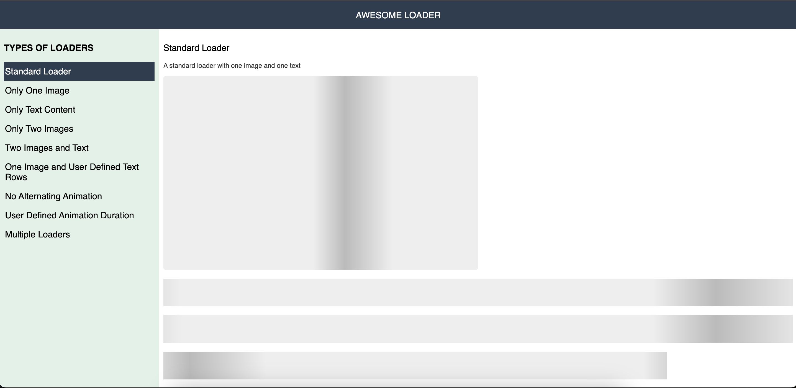

# react-loader
A dynamic and configurable loader for React components.



## Purpose
The purpose to make this utility component arises from the need to keep the users engaged while they wait for the data to load. <br />
In a typical scenario, this loader to a limited extent, give a substantial idea about what the page looks like before it is loaded and replaced by the actual content.

## Instructions
To view the code in action, kindly follow the instructions mentioned below:
1. Clone the project on to your local machine using the Git CLI command `git clone <project_id>`.
2. Ensure you are on Node version `14.16.0`.
3. Use `npm install` to install the dependencies of the project.
4. Use `npm run start` to run the code on your local machine. It should run on the URL: `https://localhost:8080`.

## Usage
One can automatically add this component by importing it and using it in their component before it loads. An example where we've mocked a network request latency is stated below:

```
import React, { useState, useEffect } from 'react';
import Loader from '@/components/Loader';
import MobilePage from '@/pages/MobilePage';

export default Home = props => {
    const [isLoading, changeLoadingState] = useState(true);

    useEffect(() => {
        setTimeout(() => {
            changeLoadingState(false);
        }, 5000);
    }, []);

    return (
        <div>
            {
                isLoading ?
                <Loader /> :
                <MobilePage />
            }
        </div>
    )
}
```

## Configuration
Following configurations/attributes can be used for your custom Loader component:

| Attribute | Description | Default Value | Accepted Values |
| ----- | ------ | ------ | ------ |
| `alternateAnimation` | Decides if the animation should be shown alternatively between the image and text, i.e. the image will be animated first and then the text will be animated | true | Boolean Values (true, false) |
| `count` | The number of times the loader component (both image and text based on the container) should be shown | 1 | Any number of numerical string, e.g. 5 or "5" |
| `displayImages` | Decides whether the image loader should be displayed | true | Boolean Values (true, false) |
| `displayText` | Decides whether the text loader should be displayed | true | Boolean Values (true, false) |
| `durationInSeconds` | The duration for which the animation should be shown | 3 | Any number of numerical string, e.g. 5 or "5" |
| `multipleImages` | Decides whether one image should be shown or two that occupies the entire width of the page | true | Boolean Values (true, false) |
| `textCount` | The number of lines that will be shown in the animation for texts | 3 | Any number of numerical string, e.g. 5 or "5" |


## Future Scope
- Convert this into a package that can be plugged into and utilised in an actual React application.
- Make it more dynamic so that it can automatically pick up the page's content and create a loading state.


